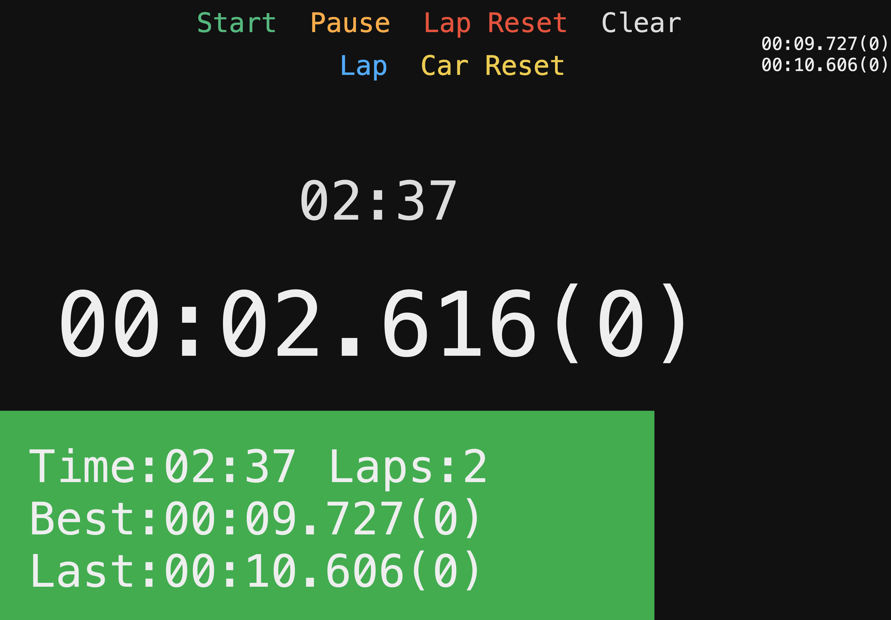

# deepracer-timer

Original concept and [code](https://github.com/nalbam/deepracer-timer) by Jungyoul Yu see his [blog post](https://blog.nalbam.com/3318) for more details.

I've removed a lot of the code I don't currently need and changed / tidied for my needs running [AWS DeepRacer](https://aws.amazon.com/deepracer/) events.

Additionally if the timer isn't already running then it will start when the car drives over the pressure switch.

## usage

```bash
./run.sh init
./run.sh start
./run.sh restart
./run.sh status
./run.sh stop
```

## screen



The green area exists to be used when streaming events using OBS by adding in as a video source and then using a chroma key filter.

## keymap

| Action  | Key |
| ------- | --- |
| Start   |  Q  |
| Pause   |  W  |
| Passed  |  E  |
| Reset   |  R  |
| Clear   |  T  |

# Building

So for this to work you need a Raspberry Pi (tested on a Pi 4) and some basic soldering skills (and mine are basic)

### Components

* [Flex / Bend Pressure Sensor](https://smile.amazon.co.uk/gp/product/B07PM5PTPQ) x2 (for the wider tracks)
* [Sound sensor](https://www.robotshop.com/en/sound-sensor.html) x2 (one for each pressure sensor)

###

You need to de-solder the microphone from the sound sensor and add connectors so that you can run the wires from the pressure sensor to the microphone pins on the sound sensor.  This serves as an analogue to digial converter.

### Tips

Be careful how you stick the pressure sensor to the track, I've had a few times where in getting carried away in sticking the pressure sensor do the track that it's started to register false positives.  Jungyoul Yu has some photos of his build process on his [blog post](https://blog.nalbam.com/3318) which is what I based my tinkering on.

# Todo

* 3D printed box to keep the sound sensors in to protect them in transit and also when next to the track.
* Tidy the code up and look at some of the timing elements to make it easier to work with in terms of the code (feels like it could be simplified)