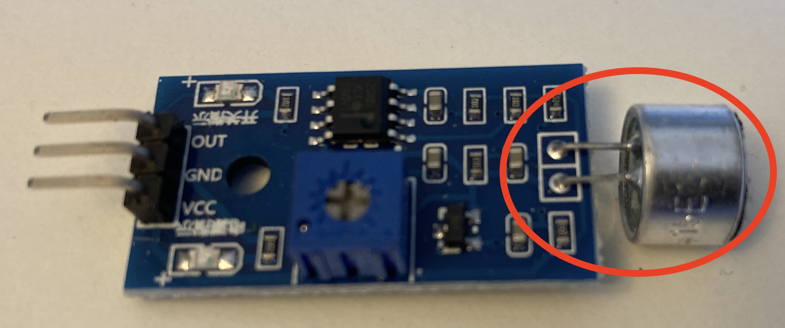
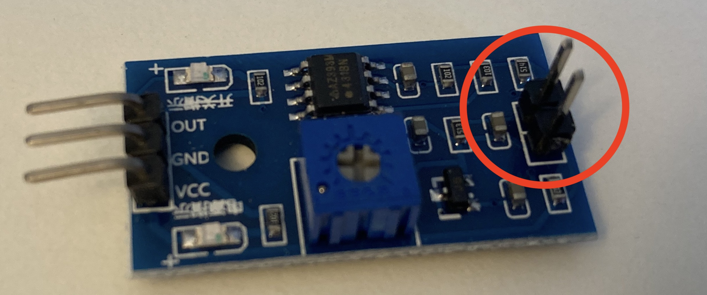
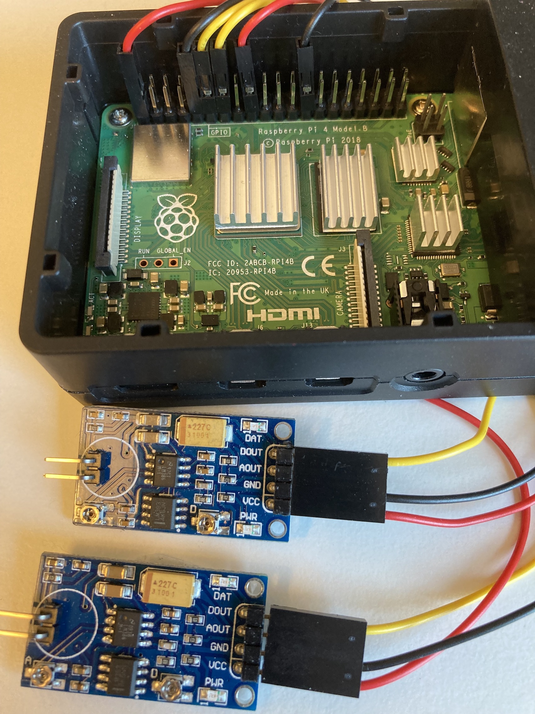
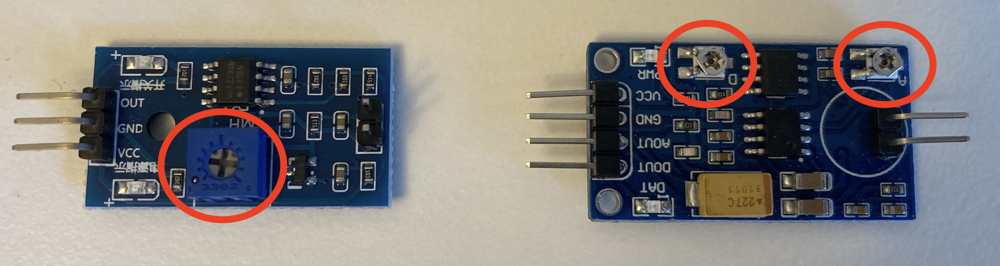
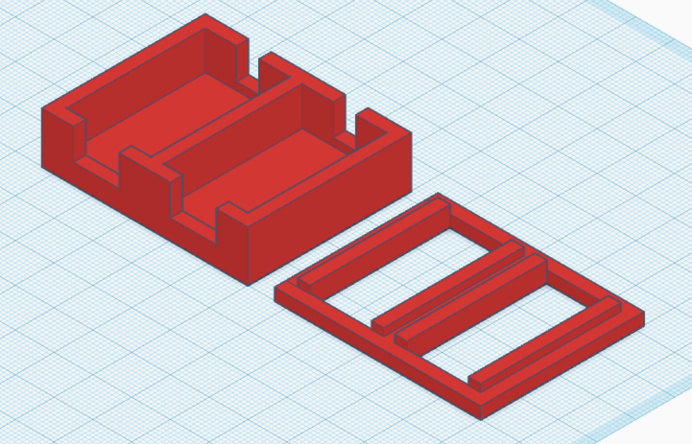

# deepracer-timer

Original concept and [code](https://github.com/nalbam/deepracer-timer) by Jungyoul Yu see his [blog post](https://blog.nalbam.com/3318) for more details.

I've removed a lot of the code I don't currently need and changed / tidied for my needs running [AWS DeepRacer](https://aws.amazon.com/deepracer/) events.

Additionally if the timer isn't already running then it will start when the car drives over the pressure switch.

## usage

```bash
./run.sh init
./run.sh start
./run.sh restart
./run.sh status
./run.sh stop
```

## screen


The green area exists to be used when streaming events using OBS by adding in as a video source and then using a chroma key filter.

## keymap

| Action  | Key |
| ------- | --- |
| Start   |  Q  |
| Pause   |  W  |
| Passed  |  E  |
| Reset   |  R  |
| Clear   |  T  |

## Hardware Requirements

### Required
* Rasberry Pi 4 / Zero W (known to work)
* 2x Sound Sensors [Variant 1 - Youmile (preferred)](https://www.amazon.co.uk/Youmile-Sensitivity-Microphone-Detection-Arduino/dp/B07Q1BYDS7/ref=sr_1_1_sspa?crid=YZ2AA2SUOG67&keywords=sound+sensor&qid=1655970264&sprefix=sound+sensor%2Caps%2C84&sr=8-1-spons&psc=1&smid=A3BN2T8LLIRB5S&spLa=ZW5jcnlwdGVkUXVhbGlmaWVyPUExMU5PTFY5WTlKTk8wJmVuY3J5cHRlZElkPUEwODEwNzkzM1ZCVU42MDdJQTdVUSZlbmNyeXB0ZWRBZElkPUEwNzMzMTg2MzNISEdLSjhINDRHNCZ3aWRnZXROYW1lPXNwX2F0ZiZhY3Rpb249Y2xpY2tSZWRpcmVjdCZkb05vdExvZ0NsaWNrPXRydWU=) / [Variant 2 - WaveShare](https://www.waveshare.com/sound-sensor.htm) 
* 2x [Pressure sensor](https://www.amazon.co.uk/gp/product/B07PM5PTPQ)
* 2X 1.5m, two core flat wire between sound sensor and pressure sensors
* Soldering iron

### Optional
* PoE hat / case for Pi Zero [https://www.waveshare.com/poe-eth-usb-hub-box.htm]()
* PoE splitter (for use with Pi 4) [https://www.amazon.co.uk/gp/product/B0832QR4NG]()

**Note:** only required if you intend to use a PoE switch at the track for powering AP's and the Raspberry Pi

## Hardware Setup

### Preassure sensors
- Solder a 1.5 m, two core wire to each preassure sensor. Isolate each solder with a heat shrink tube
- Attach a two pin female connector to the other end of the wire


### Ambient sound sensors
- Replace the speaker on each board with a two pin male connector



- Connect the output male connector to the RPI GPIO pins


| Cable         | Sound sensor  | RPI 4  
| ------------- | ------------- | --------    |
| Red           | VCC           | +3.3V, Pin 1 & 17   |
| Black         | GND           | Pin 9 & 25   |
| Yellow        | DOUT          | Pin 11 (GPIO17) & Pin 13 (GPIO27)   |

## Software setup

### Raspberry Pi Operating System

To install the Raspberry Pi (RPi) OS on an SD card the recommended approach is using the [Raspberry Pi Imager](https://www.raspberrypi.com/software/)

Once installed choose the one of the following images based on RPi

* RPi 4 : Raspberry Pi OS (Other) -> Raspberry Pi OS Lite (64-bit)
* RPi Zero W : Raspberry Pi OS (Other) -> Raspberry Pi OS Lite (32-bit)

## Pressure sensor positioning

The pressue sensors work best when they are positioned at the back of the start / finish line and not the front (so the car has crossed the majoirity of the start / finish line before touching the sensors) and when positioning a car to start a race, it can be placed 50cm from the start / finish line.

## Calibration

The Youmile sound sensor boards have one screw (easier to use) for calibration whereas the WaveShare sound sensor boards have two screws for claibrcalibrationation, turn the screws to increase/decrease the trigger sensitivity.



- If laps are triggered but nothing has touched the preassure sensors.Turn the screw(s) slowly until there is only one led lit. 

- If no laps are triggered. Turn the screw(s) so that both leds are lit and then slowly back until there is only one led lit.

## Tips

Be careful how you stick the pressure sensor to the track, I tend to use doublesided tape applied to the back of the sensor, I've had a few times where in getting carried away in sticking the pressure sensor to the track that it's started to register false positives.  Jungyoul Yu has some photos of his build process on his [blog post](https://blog.nalbam.com/3318) which is what I based my tinkering on.

## Sensor Holder

There is an `.stl` file to print out the sensor box choose the right `.stl` file for the sensors you have.

* [Timerbox Youmile sensors](./stl/timerbox_youmile.stl)
* [Timerbox WaveShare sensors](./stl/timerbox_waveshare.stl) - slightly larger sensors



# Todo

* Tidy the code up and look at some of the timing elements to make it easier to work with in terms of the code (feels like it could be simplified)